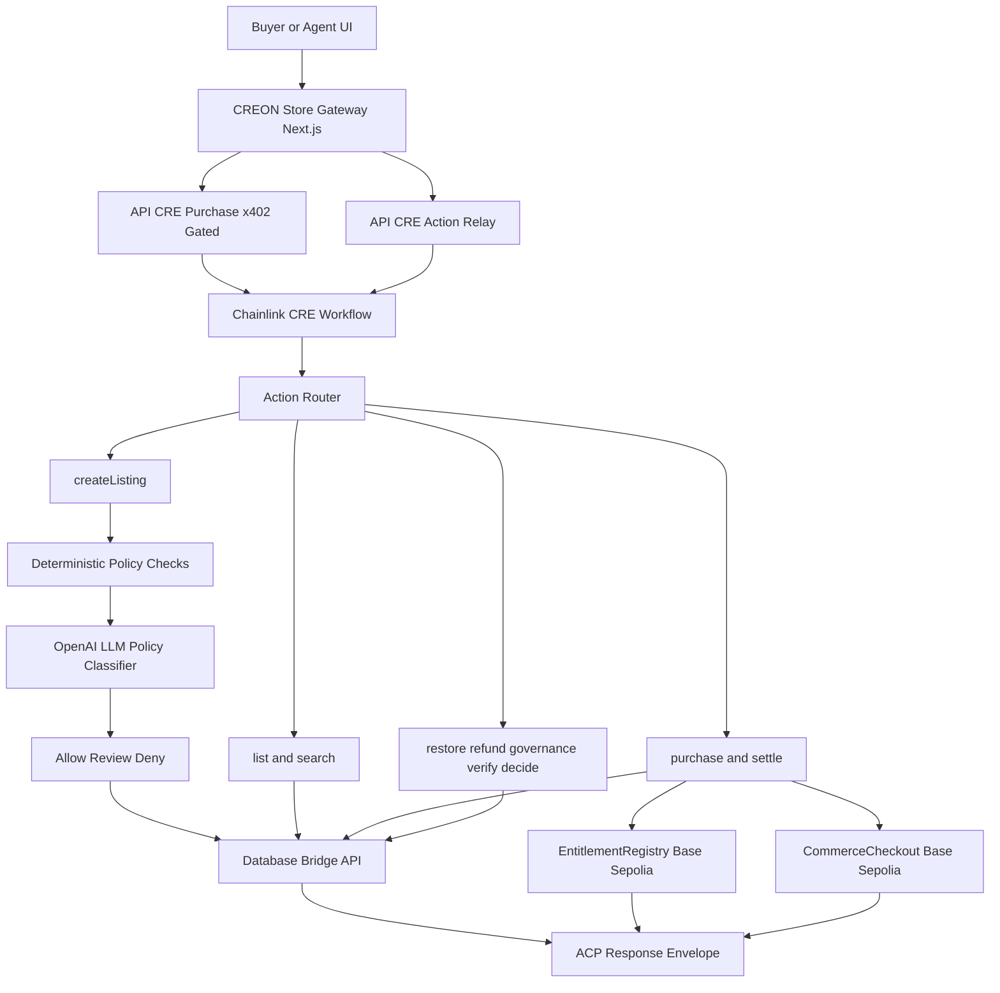

# CREON

CREON is an agentic commerce system built on **Chainlink Runtime Environment (CRE)** workflows, with **x402-gated purchases**, **AI policy decisions for listings**, and **onchain entitlement + settlement execution**.

## Judge Quick Scan
- **CRE is core, not optional**: the main business logic lives in [`workflow/main.ts`](workflow/main.ts) and routes into [`workflow/process/`](workflow/process/).
- **AI is in-the-loop**: listing risk/compliance decisions call OpenAI via [`workflow/integration/openai.ts`](workflow/integration/openai.ts) with system prompt in [`workflow/lib/prompts/listingPolicy.ts`](workflow/lib/prompts/listingPolicy.ts).
- **x402 gates paid access**: protected purchase endpoint is served through [`creon-store/proxy.ts`](creon-store/proxy.ts) and [`creon-store/app/api/cre/purchase/route.ts`](creon-store/app/api/cre/purchase/route.ts).
- **Web3 execution is verifiable**: entitlement writes on Base Sepolia through [`contracts/src/EntitlementRegistry.sol`](contracts/src/EntitlementRegistry.sol), and fee split/payout through [`contracts/src/CommerceCheckout.sol`](contracts/src/CommerceCheckout.sol).
- **Agentic Commerce Protocol response envelope**: workflow responses include an `acp` object (Agentic Commerce Protocol format).

## What CREON Does
- Creates listings with deterministic checks plus AI-based policy classification.
- Stores and searches listings in the database.
- Verifies x402 purchase proof and records purchase intent.
- Grants entitlement onchain.
- Settles merchant payout through checkout split (platform fee + merchant net).
- Supports restore, refund review path, governance status updates, and verification routes.

## Architecture


Fallback text view:
```text
Buyer/Agent UI
  -> Next.js Gateway (creon-store)
      -> /api/cre/purchase (x402-gated)
      -> /api/cre/{action} (public action relay)
          -> Chainlink CRE Workflow (workflow/main.ts)
              -> createListing/list/search/purchase/settle/restore/refund/governance/verify/decide
              -> OpenAI policy classifier (listing path)
              -> Database bridge (/api/db/[action])
              -> Base Sepolia contracts:
                   - EntitlementRegistry (entitlement write)
                   - CommerceCheckout (fee split + merchant payout)
              -> Agentic Commerce Protocol response envelope (`acp`)
```

## Where To Look In Code
### CRE workflow core
- Entry and router: [`workflow/main.ts`](workflow/main.ts)
- Action handlers: [`workflow/process/`](workflow/process/)
- Runtime logs/scopes: [`workflow/lib/log.ts`](workflow/lib/log.ts)

### AI integration
- OpenAI client integration: [`workflow/integration/openai.ts`](workflow/integration/openai.ts)
- Listing policy system prompt: [`workflow/lib/prompts/listingPolicy.ts`](workflow/lib/prompts/listingPolicy.ts)
- Listing action using AI decision: [`workflow/process/createListing.ts`](workflow/process/createListing.ts)

### x402 gateway
- Next.js proxy (Next 16): [`creon-store/proxy.ts`](creon-store/proxy.ts)
- x402-gated purchase route: [`creon-store/app/api/cre/purchase/route.ts`](creon-store/app/api/cre/purchase/route.ts)
- Frontend gateway/payload generator: [`creon-store/components/cre-gateway-console.tsx`](creon-store/components/cre-gateway-console.tsx)

### Database bridge
- DB API route used by workflow and frontend: [`creon-store/app/api/db/[action]/route.ts`](creon-store/app/api/db/[action]/route.ts)

### Onchain contracts
- Entitlement registry: [`contracts/src/EntitlementRegistry.sol`](contracts/src/EntitlementRegistry.sol)
- Checkout split contract: [`contracts/src/CommerceCheckout.sol`](contracts/src/CommerceCheckout.sol)
- Deploy scripts: [`contracts/script/DeployEntitlementRegistry.s.sol`](contracts/script/DeployEntitlementRegistry.s.sol), [`contracts/script/DeployCommerceCheckout.s.sol`](contracts/script/DeployCommerceCheckout.s.sol)

## End-to-End Flow (Listing -> Purchase -> Settle)
1. **Create listing**
`createListing` generates authoritative `productId` (`SKU_...`), runs deterministic checks, then (if enabled) OpenAI risk/compliance classification.
2. **Purchase (x402)**
Buyer pays via x402-gated endpoint (`paymentTxHash`), workflow validates proof, records purchase, and writes entitlement (`entitlementTxHash`).
3. **Settle payout**
`settle` executes checkout release and marks settlement complete with `settlementTxHash`.

Hash semantics:
- `paymentTxHash`: buyer payment proof tx hash.
- `entitlementTxHash`: entitlement write tx hash.
- `settlementTxHash`: checkout payout tx hash.

Status semantics:
- `PENDING`: payout queued, not released yet.
- `SETTLED`: payout released and recorded.

## Required Environment
Copy [`.env.example`](.env.example) to [`.env`](.env) and set at minimum:
- `CRE_ETH_PRIVATE_KEY`
- `MONGODB_ATLAS_URI`
- `MONGODB_DATABASE`
- `MONGODB_DB_API_URL` (default `http://localhost:3000/api/db`)
- `ENABLE_POLICY_CHECKS`
- `OPENAI_API_KEY` (required when policy checks enabled)
- `COMMERCE_USDC_ADDRESS`
- `ENTITLEMENT_REGISTRY_ADDRESS`
- `COMMERCE_CHECKOUT_ADDRESS`
- `AGENT_WALLET_PRIVATE_KEY`

## Local Simulation
1. Start store gateway + database bridge:
```bash
cd creon-store
bun install
bun run dev
```

2. Run listing fixture:
```bash
cre workflow simulate ./workflow --target=staging-settings --non-interactive --trigger-index=0 --http-payload "@$(pwd)/workflow/fixtures/create_listing_template_pack.json"
```

3. Run purchase fixture:
```bash
cre workflow simulate ./workflow --broadcast --target=staging-settings --non-interactive --trigger-index=0 --http-payload "@$(pwd)/workflow/fixtures/purchase_success_x402.json"
```

4. Run settlement fixture:
```bash
cre workflow simulate ./workflow --broadcast --target=staging-settings --non-interactive --trigger-index=0 --http-payload "@$(pwd)/workflow/fixtures/settle_success.json"
```

## Fixture Tour
All ready payloads are in [`workflow/fixtures/`](workflow/fixtures/).
Useful starting points:
- Listing allow: [`workflow/fixtures/create_listing_template_pack.json`](workflow/fixtures/create_listing_template_pack.json)
- Listing deny (policy): [`workflow/fixtures/create_listing_underground_access_kit.json`](workflow/fixtures/create_listing_underground_access_kit.json)
- Purchase success (x402): [`workflow/fixtures/purchase_success_x402.json`](workflow/fixtures/purchase_success_x402.json)
- Settle success: [`workflow/fixtures/settle_success.json`](workflow/fixtures/settle_success.json)
- Full fixture index: [`workflow/fixtures/INDEX.json`](workflow/fixtures/INDEX.json)

## Contract Deployment (Base Sepolia)
Detailed contract instructions live in [`contracts/README.md`](contracts/README.md).

Quick start:
```bash
cd contracts
forge script script/DeployEntitlementRegistry.s.sol:DeployEntitlementRegistry --rpc-url base_sepolia --broadcast
forge script script/DeployCommerceCheckout.s.sol:DeployCommerceCheckout --rpc-url base_sepolia --broadcast
```

Then write deployed addresses to:
- [`workflow/config.staging.json`](workflow/config.staging.json)
- [`workflow/config.production.json`](workflow/config.production.json)

## License
Licensed under Apache 2.0. See [`LICENSE`](LICENSE).
