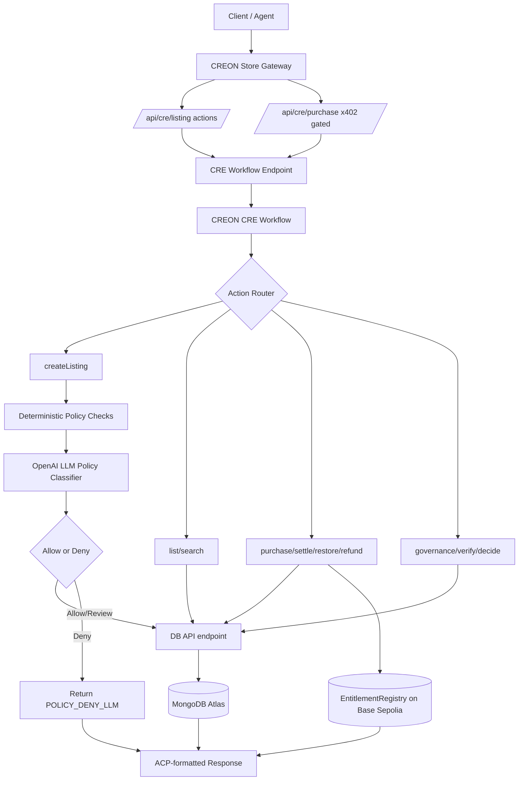

# CREON

Agentic commerce built on Chainlink CRE workflows.

## Current Architecture
- Workflow runs core commerce logic in [`workflow/`](workflow/)
- OpenAI LLM policy classifier runs inside workflow `createListing` path via [`workflow/integration/openai.ts`](workflow/integration/openai.ts) using system prompt from [`workflow/lib/prompts/listingPolicy.ts`](workflow/lib/prompts/listingPolicy.ts)
- Public API gateway is served by Next.js via [`creon-store/app/api/cre/[action]/route.ts`](creon-store/app/api/cre/[action]/route.ts) for non-purchase actions and [`creon-store/app/api/cre/purchase/route.ts`](creon-store/app/api/cre/purchase/route.ts) for x402 purchase
- Next.js request guard uses [`creon-store/proxy.ts`](creon-store/proxy.ts) (Next 16 proxy, not middleware)
- MongoDB access is handled via Next.js route [`creon-store/app/api/db/[action]/route.ts`](creon-store/app/api/db/[action]/route.ts)
- Next.js route connects to Atlas using `MONGODB_ATLAS_URI`
- Workflow calls the route through `MONGODB_DB_API_URL`
- Workflow can also call MongoDB Atlas Data API directly via `MONGODB_DATA_API_URL` (with `MONGODB_DATA_API_KEY` and `MONGODB_DATA_SOURCE`)
- Workflow responses include an `acp` envelope aligned with the Agentic Commerce Protocol (a standard response format for agent-driven checkout and commerce flows): https://agentic-commerce-protocol.com/



## Workflow Coverage
Current workflow actions in [`workflow/process/`](workflow/process/):
- `createListing`: create a product listing, optionally run policy checks, then write to MongoDB.
- `list`: list products from MongoDB (`ACTIVE` and non-banned by default).
- `search`: text and tag search over listings.
- `purchase`: verify payment proof, enforce fee from `COMMERCE_CHECKOUT_ADDRESS` onchain quote when configured (fallback `COMMERCE_FEE_BPS`), collect gross to agent wallet, record fee/net settlement ledger, queue merchant payout (`settlement_queue`), detect duplicates, write purchase + entitlement, and record onchain entitlement.
- `settle`: execute checkout payout for queued records (when tx hash is not provided), then mark settlement as completed and attach `settlementTxHash`.
- `restore`: validate ownership and product status before restore.
- `refund`: allow refunds only for duplicate purchase of same `buyer + productId` with entitlement checks.
- `governance`: update product lifecycle status (`ACTIVE`, `PAUSED`, `DISCONTINUED`, `BANNED`).
- `verify`: normalize payment proof and return canonical payment metadata.
- `decide`: generic allow/deny decision route for agent orchestration.

For x402 transfer-only flows (no calldata params), CREON uses a two-step settlement model:
- purchase tx sends gross amount to agent wallet (`payTo`)
- workflow verifies proof and fee, then queues merchant net payout in `settlement_queue`
- `purchase` returns `paymentTxHash` (buyer payment) and `entitlementTxHash` (registry write)
- merchant payout tx hash is attached during `settle` as `settlementTxHash`
- do not pass buyer `paymentTxHash` into `settle`; leaving settlement hash empty triggers checkout payout execution and returns real `settlementTxHash`

## Required Env
Copy [`.env.example`](.env.example) to [`.env`](.env) and set:
- `CRE_ETH_PRIVATE_KEY`
- `MONGODB_ATLAS_URI`
- `MONGODB_DATABASE`
- `MONGODB_DB_API_URL` (default `http://localhost:3000/api/db`)
- `MONGODB_DB_API_KEY` (optional)
- `ENABLE_POLICY_CHECKS` (`false` to skip OpenAI policy checks for listing)
- `COMMERCE_FEE_BPS` (default `100`, max `2500`)
- `AGENT_WALLET_PRIVATE_KEY` (server-side signer used by `/api/checkout/settle`)
- `COMMERCE_CHECKOUT_SETTLE_API_URL` (default `http://localhost:3000/api/checkout/settle`)
- `COMMERCE_CHECKOUT_SETTLE_API_KEY` (optional shared key between workflow and settle API)

If `ENABLE_POLICY_CHECKS=false`, `createListing` does not require OpenAI keys.

## OpenAI LLM Usage
The OpenAI model is used in `createListing` for policy classification when
`ENABLE_POLICY_CHECKS=true`.

What it does:
- Runs deterministic checks first.
- Sends listing context to OpenAI ([`workflow/integration/openai.ts`](workflow/integration/openai.ts)) for risk classification.
- Returns `complianceFlags`, `complianceDomains`, `evidence`, `riskTier`, `recommendedPolicy`, and `confidence`.
- Denies listing when the model returns `recommendedPolicy = deny`.

## Risk And Compliance Commitment
CREON treats digital goods/services listing safety as a first-class workflow responsibility.

- Every `createListing` request can run a policy gate before a product is published.
- The policy gate combines deterministic signals with LLM classification for final allow/deny.
- The classifier tags compliance domains (financial crime, sanctions/trade, IP abuse, malware/cybercrime, deceptive marketing, consumer protection).
- The classifier also returns short evidence strings to explain why a listing was allowed, sent to review, or denied.
- Denials return explicit machine-readable reason codes such as `POLICY_DENY_LLM` for downstream governance/audit flows.
- Workflow always generates the authoritative `productId` in `SKU_...` format before write.
- If a client sends `listing.productId`, it is ignored and returned as `clientProvidedProductId` for audit/debug only.

Required env for LLM path:
- `ENABLE_POLICY_CHECKS=true`
- `OPENAI_API_KEY`
- `OPENAI_MODEL` (default `gpt-4o-mini`)
- `OPENAI_BASE_URL` (default `https://api.openai.com/v1`)
- `OPENAI_API_KEY` can be set in `.env` or as workflow secret `OPENAI_API_KEY`

## Local Run
1. Start the DB API server.
This runs the Next.js `/api/db/[action]` bridge that the workflow calls for MongoDB reads and writes.

```bash
cd creon-store
bun install
bun run dev
```

2. Run the workflow with a sample listing fixture.
This sends a `createListing` input that inserts a product into the `products` collection.

```bash
cre workflow simulate ./workflow --target=staging-settings --non-interactive --trigger-index=0 --http-payload "@$(pwd)/workflow/fixtures/create_listing_template_pack.json"
```

For `create_listing_template_pack.json`, generated `productId` is deterministic:
- `SKU_11111111_TEMPLATE_PREMIUMG_A00F3B7E`

## Onchain Contract
`EntitlementRegistry` source and deploy script are in:
- [`contracts/src/EntitlementRegistry.sol`](contracts/src/EntitlementRegistry.sol)
- [`contracts/script/DeployEntitlementRegistry.s.sol`](contracts/script/DeployEntitlementRegistry.s.sol)
- [`contracts/src/CommerceCheckout.sol`](contracts/src/CommerceCheckout.sol)
- [`contracts/script/DeployCommerceCheckout.s.sol`](contracts/script/DeployCommerceCheckout.s.sol)
- [`contracts/README.md`](contracts/README.md)

### Deploy On Base Sepolia
From repo root:

```bash
cd contracts
forge install foundry-rs/forge-std
```

Set required env vars:

```bash
export CRE_ETH_PRIVATE_KEY=0xYOUR_PRIVATE_KEY
export CRE_FORWARDER_ADDRESS=0xYOUR_FORWARDER_ADDRESS
```

Deploy:

```bash
forge script script/DeployEntitlementRegistry.s.sol:DeployEntitlementRegistry \
  --rpc-url base_sepolia \
  --broadcast
```

After deploy, copy the printed contract address to workflow config:
- `workflow/config.staging.json`
- `workflow/config.production.json`

Set:
- `ENTITLEMENT_REGISTRY_ADDRESS=0x...`

Deploy checkout with fixed fee recipient:

```bash
forge script script/DeployCommerceCheckout.s.sol:DeployCommerceCheckout \
  --rpc-url base_sepolia \
  --broadcast
```

## Fixture Test Matrix
Fixtures are sample store scenarios you can feed directly to the workflow.
Use this command pattern for any fixture:

```bash
cre workflow simulate ./workflow --target=staging-settings --non-interactive --trigger-index=0 --http-payload "@$(pwd)/workflow/fixtures/<fixture>.json"
```

## Allow And Deny Listing Runs
Allow example (professional template bundle, low-risk storefront content):

```bash
cre workflow simulate ./workflow --target=staging-settings --non-interactive --trigger-index=0 --http-payload "@$(pwd)/workflow/fixtures/create_listing_template_pack.json"
```

Deny example A (blocked illicit goods keywords like "stolen" and "exploit kit"):

```bash
cre workflow simulate ./workflow --target=staging-settings --non-interactive --trigger-index=0 --http-payload "@$(pwd)/workflow/fixtures/create_listing_underground_access_kit.json"
```

Deny example B (scam phrases plus extreme price outlier):

```bash
cre workflow simulate ./workflow --target=staging-settings --non-interactive --trigger-index=0 --http-payload "@$(pwd)/workflow/fixtures/create_listing_profit_multiplier_vault.json"
```

Expected deny reason code:
- `POLICY_DENY_LLM` (OpenAI is final decision maker when policy checks are enabled).

Additional policy-challenge listing scenarios (for system-prompt testing):
- [`create_listing_brand_clone_starter.json`](workflow/fixtures/create_listing_brand_clone_starter.json): brand impersonation/copycat storefront.
- [`create_listing_malware_loader_bundle.json`](workflow/fixtures/create_listing_malware_loader_bundle.json): stealth payload distribution language.
- [`create_listing_enterprise_playbook.json`](workflow/fixtures/create_listing_enterprise_playbook.json): normal enterprise operations content.
- [`create_listing_roi_signals_membership.json`](workflow/fixtures/create_listing_roi_signals_membership.json): aggressive ROI promise style marketing.

Suggested tour:
1. [`create_listing_template_pack.json`](workflow/fixtures/create_listing_template_pack.json) creates a product listing.
2. [`create_listing_template_pack_llm.json`](workflow/fixtures/create_listing_template_pack_llm.json) runs the same listing for explicit LLM-path verification.
3. [`create_listing_underground_access_kit.json`](workflow/fixtures/create_listing_underground_access_kit.json) tests high-risk illicit wording.
4. [`create_listing_profit_multiplier_vault.json`](workflow/fixtures/create_listing_profit_multiplier_vault.json) tests scam-style claims and outlier pricing.
5. [`create_listing_brand_clone_starter.json`](workflow/fixtures/create_listing_brand_clone_starter.json) tests brand impersonation signals.
6. [`create_listing_malware_loader_bundle.json`](workflow/fixtures/create_listing_malware_loader_bundle.json) tests malicious distribution signals.
7. [`create_listing_enterprise_playbook.json`](workflow/fixtures/create_listing_enterprise_playbook.json) tests a low-risk business listing.
8. [`create_listing_roi_signals_membership.json`](workflow/fixtures/create_listing_roi_signals_membership.json) tests aggressive performance-marketing language.
9. [`list_basic.json`](workflow/fixtures/list_basic.json) shows current listings (basic storefront feed).
10. [`search_templates.json`](workflow/fixtures/search_templates.json) filters listings by query and tags.
11. [`purchase_success_x402.json`](workflow/fixtures/purchase_success_x402.json) tests successful purchase via x402 proof.
12. [`purchase_success_tx.json`](workflow/fixtures/purchase_success_tx.json) tests successful purchase via direct tx proof.
13. [`purchase_fee_mismatch.json`](workflow/fixtures/purchase_fee_mismatch.json) shows configured fee guardrails returning denial.
14. [`purchase_duplicate_proof.json`](workflow/fixtures/purchase_duplicate_proof.json) and [`purchase_already_owned.json`](workflow/fixtures/purchase_already_owned.json) exercise duplicate detection.
15. [`restore_owned.json`](workflow/fixtures/restore_owned.json) and [`restore_not_owned.json`](workflow/fixtures/restore_not_owned.json) test ownership restore checks.
16. [`refund_request.json`](workflow/fixtures/refund_request.json) and [`refund_eligible_review.json`](workflow/fixtures/refund_eligible_review.json) test duplicate-only refund policy.
17. [`governance_pause.json`](workflow/fixtures/governance_pause.json) and [`governance_ban.json`](workflow/fixtures/governance_ban.json) test status updates.
18. [`verify_tx.json`](workflow/fixtures/verify_tx.json) tests proof normalization output only.
19. [`decide_allow.json`](workflow/fixtures/decide_allow.json) and [`decide_deny.json`](workflow/fixtures/decide_deny.json) test generic decision routing.
20. [`settle_success.json`](workflow/fixtures/settle_success.json) and [`settle_not_found.json`](workflow/fixtures/settle_not_found.json) test the two-step settlement completion flow.
